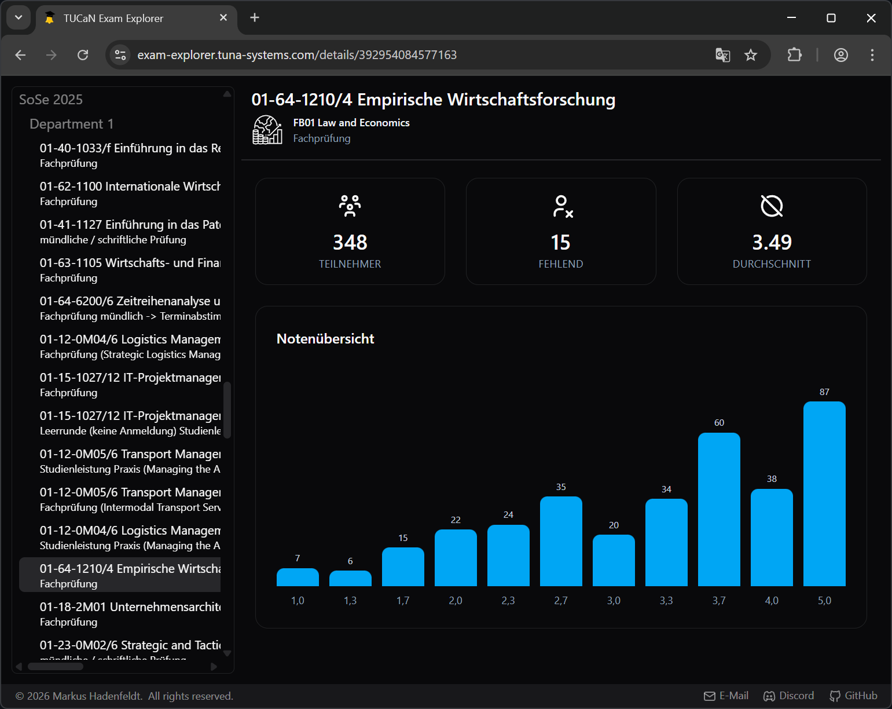

# TUCaN exam explorer
TUCaN Exam Explorer is an open and collaborative project dedicated to collecting and organizing publicly accessible exam grade overview information for exams conducted at Technische Universität Darmstadt.

Have you ever wondered:
- How hard is this course really?
- How do students usually perform on this exam?
- Is this module a GPA booster or a trap?
- What should I expect before signing up?

You're not alone. And that’s exactly why this project exists.  
TUCaN's interface gives you the data for your taken exams, but not the overview.
This repo aims to fix that by building the basis for gathering exam grade distributions, making them easier to browse, compare, and analyze.

The actual grade overview data will be accessible to all TU Darmstadt students here:  
[https://exam-explorer.tuna-systems.com](https://exam-explorer.tuna-systems.com)

To view the grade data, you must authenticate with your TU Darmstadt student email.  
**Your email address and any personal information will not be stored**.
Authentication is only used to verify that you are a valid student.

## Screenshots


## Contributing
If you want to contribute exam statistics, you can do so in just a few steps.
Although the process is still a bit technical at the moment, it will be simplified in the future.

1. Visit and login to TUCaN.  
2. Open your browser’s developer tools.  
   Instructions for [Chrome](https://developer.chrome.com/docs/devtools/open#last)
3. Switch to the Console tab and paste the following snippet:  
   <details>
      <summary>Show Script</summary>
      
      ```js
      console.log(`Generating a list of exam ids. Please wait...`);
      const sessionId = location.search.match(/-N(\d+)/)[1];
      await fetch(
          `?APPNAME=CampusNet&PRGNAME=EXAMRESULTS&ARGUMENTS=-N${sessionId},-N000325,-N999`
      )
          .then((response) => response.text())
          .then((response) => {
              if (response.includes("timeout.htm")) {
                  throw "Session timed out. Please refresh the current page.";
              }
      
              const examIds = [
                  ...response
                      .matchAll(
                          /GRADEOVERVIEW&amp;ARGUMENTS=-N\d+,-N\d+,-AEXEV,-N(\d+)/gm
                      )
                      .map((match) => match[1]),
              ];
              console.log(
                  `Successfully grathered the following exam ids (${
                      examIds.length
                  }):\n${examIds.join("\n")}`
              );
          })
          .catch((error) => {
              console.error(`Failed to generate a list of exam ids:`);
              console.error(error);
          });
      ``` 
   </details>

4. Create a new GitHub issue and include the generated output.  

Note: The output does not contain any private or sensitive information.

## Privacy notes
All data collected in this repository is non-personal and non-confidential.
The TUCaN exam ids referenced here do not contain any personal information, nor do they reveal any details about individual students or exam participants.

Possessing an exam id alone does not grant access to sensitive or protected information.
Any exam-related data requires valid authentication with TUCaN.
Without logging into TUCaN with appropriate user credentials, a third party cannot retrieve private information about an exam based solely on its id.
